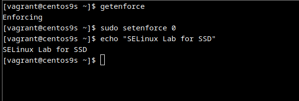
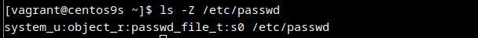
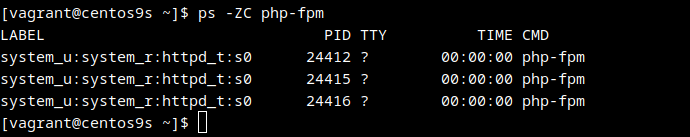
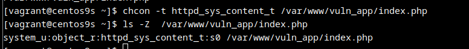
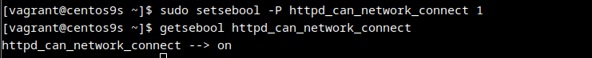
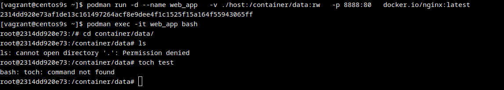
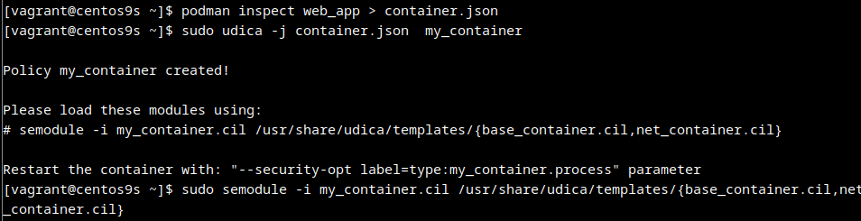
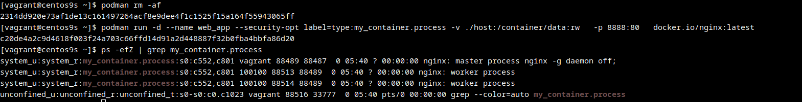

# SELinux Security Report

## 1. How SELinux Works

SELinux (Security-Enhanced Linux) is a Mandatory Access Control (MAC) system integrated into the Linux kernel. It enhances system security by enforcing access control policies that define how processes and users can interact with system resources. Unlike traditional Discretionary Access Control (DAC), where users control access to their own files, SELinux enforces policies defined by the system administrator, providing a more robust security model.

- **Mandatory Access Control (MAC):** SELinux uses MAC to control access to system resources. This means that every access attempt is checked against the loaded security policy to determine whether it should be allowed.
- **Security Contexts:** Every process, file, directory, and port in an SELinux-enabled system is labeled with a security context. A security context contains information about the user, role, type, and security level (MLS/MCS) associated with the object.
- **Policies:** SELinux policies are sets of rules that define the allowed interactions between security contexts. These policies are loaded into the kernel and used to make access control decisions.
- **Type Enforcement:** Type enforcement is the primary mechanism used by SELinux to control access. It defines rules that specify which types of processes can access which types of files, directories, and other resources.

**Key Components:**

| Component          | Description                          |
|--------------------|--------------------------------------|
| Security Context   | Label containing user:role:type:level |
| Policy             | Set of rules defining allowed access |
| Domain             | Security context for processes       |
| Type Enforcement   | Primary access control mechanism     |

---

## 2. SELinux Modes

Check current mode:

```bash
getenforce
# Output: Enforcing/Permissive/Disabled
sudo setenforce 0
```

To verify the change:

```bash
getenforce
```



---

## 3. SELinux Examples

### File Context

To view the SELinux context of a file, use the `ls -Z` command:

```bash
ls -Z /etc/passwd
# Output: system_u:object_r:passwd_file_t:s0 /etc/passwd
```

This output shows the security context of `/etc/passwd`. The context is composed of:
- `system_u`: User
- `object_r`: Role
- `passwd_file_t`: Type
- `s0`: Level

To verify the context:

```bash
ls -Z /etc/passwd
```



### Process Context

To view the SELinux context of a running process, use the `ps -ZC` command:

```bash
ps -ZC php-fpm
# Output: system_u:system_r:httpd_t:s0
```

This output shows the security context of the `php-fpm` process.

To verify the context:

```bash
ps -ZC php-fpm
```



### Change File Context

To change the SELinux context of a file, use the `chcon` command. For example, to change the context of `/var/www/vuln_app/index.php` to `httpd_sys_content_t`:

```bash
sudo chcon -t httpd_sys_content_t /var/www/vuln_app/index.php
```

This command modifies the file context to allow the HTTP server to access the file.

To verify the change:

```bash
ls -Z /var/www/vuln_app/index.php
```



### Allow HTTPD Network Access

To allow the HTTPD service to connect to the network, use the `setsebool` command:

```bash
sudo setsebool -P httpd_can_network_connect 1
```

This command enables the `httpd_can_network_connect` boolean, allowing HTTPD to make network connections. The `-P` option makes the change persistent across reboots.

To verify the change:

```bash
getsebool httpd_can_network_connect
```



---

## 4. Configuring Security Policies for Containers Using Udica

Udica is a tool used to generate SELinux policies for containers. It analyzes the container's contents and generates a policy that allows the container to run with minimal necessary permissions.

### Installation

First, install Udica:

```bash
sudo dnf install udica -y
```

### Usage

#### Start podman container with following parameters

```
podman run -d --name web_app   -v ./host:/container/data:rw   -p 8888:80   docker.io/nginx:latest
```



Access mounted is not working.

#### Creating SELinux policy for container
To create policy for it udica tool could be used. Parameter '-j' is for container json file and SELinux policy name for container.



#### Checking the policy
Container is now running with my_container.process type:



SELinux now allows access to mount points:


Example of alerts found by running ansible roles:
```
TASK [Show security alerts] ****************************************************************************************************************************************************************************************
ok: [default] => {
    "security_report.stdout_lines": [
        "",
        "found 2 alerts in /var/log/audit/audit.log",
        "--------------------------------------------------------------------------------",
        "",
        "SELinux is preventing /usr/bin/bash from using the dac_read_search capability.",
        "",
        "*****  Plugin dac_override (91.4 confidence) suggests   **********************",
        "",
        "If you want to help identify if domain needs this access or you have a file with the wrong permissions on your system",
        "Then turn on full auditing to get path information about the offending file and generate the error again.",
        "Do",
        "",
        "Turn on full auditing",
        "# auditctl -w /etc/shadow -p w",
        "Try to recreate AVC. Then execute",
        "# ausearch -m avc -ts recent",
        "If you see PATH record check ownership/permissions on file, and fix it,",
        "otherwise report as a bugzilla.",
        "",
        "*****  Plugin catchall (9.59 confidence) suggests   **************************",
        "",
        "If you believe that bash should have the dac_read_search capability by default.",
        "Then you should report this as a bug.",
        "You can generate a local policy module to allow this access.",
        "Do",
        "allow this access for now by executing:",
        "# ausearch -c '20-chrony-dhcp' --raw | audit2allow -M my-20chronydhcp",
        "# semodule -X 300 -i my-20chronydhcp.pp",
        "",
        "",
        "Additional Information:",
        "Source Context                system_u:system_r:NetworkManager_dispatcher_chrony",
        "                              c_t:s0",
        "Target Context                system_u:system_r:NetworkManager_dispatcher_chrony",
        "                              c_t:s0",
        "Target Objects                Unknown [ capability ]",
        "Source                        20-chrony-dhcp",
        "Source Path                   /usr/bin/bash",
        "Port                          <Unknown>",
        "Host                          <Unknown>",
        "Source RPM Packages           bash-5.1.8-6.el9.x86_64",
        "Target RPM Packages           ",
        "SELinux Policy RPM            selinux-policy-targeted-38.1.55-2.el9.noarch",
        "Local Policy RPM              selinux-policy-targeted-38.1.55-2.el9.noarch",
        "Selinux Enabled               True",
        "Policy Type                   targeted",
        "Enforcing Mode                Enforcing",
        "Host Name                     centos9s.localdomain",
        "Platform                      Linux centos9s.localdomain 5.14.0-289.el9.x86_64",
        "                              #1 SMP PREEMPT_DYNAMIC Sun Mar 19 07:28:57 UTC",
        "                              2023 x86_64 x86_64",
        "Alert Count                   3",
        "First Seen                    2025-05-07 04:17:15 UTC",
        "Last Seen                     2025-05-07 04:17:15 UTC",
        "Local ID                      177855f9-1640-49d1-8b2e-0491d30d9c0e",
        "",
        "Raw Audit Messages",
        "type=AVC msg=audit(1746591435.674:609): avc:  denied  { dac_read_search } for  pid=4354 comm=\"20-chrony-dhcp\" capability=2  scontext=system_u:system_r:NetworkManager_dispatcher_chronyc_t:s0 tcontext=system_u:system_r:NetworkManager_dispatcher_chronyc_t:s0 tclass=capability permissive=0",
        "",
        "",
        "type=AVC msg=audit(1746591435.674:609): avc:  denied  { dac_override } for  pid=4354 comm=\"20-chrony-dhcp\" capability=1  scontext=system_u:system_r:NetworkManager_dispatcher_chronyc_t:s0 tcontext=system_u:system_r:NetworkManager_dispatcher_chronyc_t:s0 tclass=capability permissive=0",
        "",
        "",
        "type=SYSCALL msg=audit(1746591435.674:609): arch=x86_64 syscall=openat success=no exit=EACCES a0=ffffff9c a1=55967a91b9b0 a2=0 a3=0 items=0 ppid=4294 pid=4354 auid=4294967295 uid=0 gid=0 euid=0 suid=0 fsuid=0 egid=0 sgid=0 fsgid=0 tty=(none) ses=4294967295 comm=20-chrony-dhcp exe=/usr/bin/bash subj=system_u:system_r:NetworkManager_dispatcher_chronyc_t:s0 key=(null)",
        "ARCH=x86_64 SYSCALL=openat AUID=unset UID=root GID=root EUID=root SUID=root FSUID=root EGID=root SGID=root FSGID=root",
        "",
        "Hash: 20-chrony-dhcp,NetworkManager_dispatcher_chronyc_t,NetworkManager_dispatcher_chronyc_t,capability,dac_read_search",
        "",
        "--------------------------------------------------------------------------------",
        "",
        "SELinux is preventing /usr/bin/bash from using the dac_override capability.",
        "",
        "*****  Plugin dac_override (91.4 confidence) suggests   **********************",
        "",
        "If you want to help identify if domain needs this access or you have a file with the wrong permissions on your system",
        "Then turn on full auditing to get path information about the offending file and generate the error again.",
        "Do",
        "",
        "Turn on full auditing",
        "# auditctl -w /etc/shadow -p w",
        "Try to recreate AVC. Then execute",
        "# ausearch -m avc -ts recent",
        "If you see PATH record check ownership/permissions on file, and fix it,",
        "otherwise report as a bugzilla.",
        "",
        "*****  Plugin catchall (9.59 confidence) suggests   **************************",
        "",
        "If you believe that bash should have the dac_override capability by default.",
        "Then you should report this as a bug.",
        "You can generate a local policy module to allow this access.",
        "Do",
        "allow this access for now by executing:",
        "# ausearch -c '20-chrony-dhcp' --raw | audit2allow -M my-20chronydhcp",
        "# semodule -X 300 -i my-20chronydhcp.pp",
        "",
        "",
        "Additional Information:",
        "Source Context                system_u:system_r:NetworkManager_dispatcher_chrony",
        "                              c_t:s0",
        "Target Context                system_u:system_r:NetworkManager_dispatcher_chrony",
        "                              c_t:s0",
        "Target Objects                Unknown [ capability ]",
        "Source                        20-chrony-dhcp",
        "Source Path                   /usr/bin/bash",
        "Port                          <Unknown>",
        "Host                          <Unknown>",
        "Source RPM Packages           bash-5.1.8-6.el9.x86_64",
        "Target RPM Packages           ",
        "SELinux Policy RPM            selinux-policy-targeted-38.1.55-2.el9.noarch",
        "Local Policy RPM              selinux-policy-targeted-38.1.55-2.el9.noarch",
        "Selinux Enabled               True",
        "Policy Type                   targeted",
        "Enforcing Mode                Enforcing",
        "Host Name                     centos9s.localdomain",
        "Platform                      Linux centos9s.localdomain 5.14.0-289.el9.x86_64",
        "                              #1 SMP PREEMPT_DYNAMIC Sun Mar 19 07:28:57 UTC",
        "                              2023 x86_64 x86_64",
        "Alert Count                   3",
        "First Seen                    2025-05-07 04:17:15 UTC",
        "Last Seen                     2025-05-07 04:17:15 UTC",
        "Local ID                      05863667-cf59-497f-801c-8102247b7596",
        "",
        "Raw Audit Messages",
        "type=AVC msg=audit(1746591435.674:609): avc:  denied  { dac_read_search } for  pid=4354 comm=\"20-chrony-dhcp\" capability=2  scontext=system_u:system_r:NetworkManager_dispatcher_chronyc_t:s0 tcontext=system_u:system_r:NetworkManager_dispatcher_chronyc_t:s0 tclass=capability permissive=0",
        "",
        "",
        "type=AVC msg=audit(1746591435.674:609): avc:  denied  { dac_override } for  pid=4354 comm=\"20-chrony-dhcp\" capability=1  scontext=system_u:system_r:NetworkManager_dispatcher_chronyc_t:s0 tcontext=system_u:system_r:NetworkManager_dispatcher_chronyc_t:s0 tclass=capability permissive=0",
        "",
        "",
        "type=SYSCALL msg=audit(1746591435.674:609): arch=x86_64 syscall=openat success=no exit=EACCES a0=ffffff9c a1=55967a91b9b0 a2=0 a3=0 items=0 ppid=4294 pid=4354 auid=4294967295 uid=0 gid=0 euid=0 suid=0 fsuid=0 egid=0 sgid=0 fsgid=0 tty=(none) ses=4294967295 comm=20-chrony-dhcp exe=/usr/bin/bash subj=system_u:system_r:NetworkManager_dispatcher_chronyc_t:s0 key=(null)",
        "ARCH=x86_64 SYSCALL=openat AUID=unset UID=root GID=root EUID=root SUID=root FSUID=root EGID=root SGID=root FSGID=root",
        "",
        "Hash: 20-chrony-dhcp,NetworkManager_dispatcher_chronyc_t,NetworkManager_dispatcher_chronyc_t,capability,dac_override"
    ]
}
```